# Orchestrator Progress — Architecture Redesign

## What's Broken (Design-Level)

The current flow scatters writes across concurrent fire-and-forget promises:

```mermaid
sequenceDiagram
    participant Tool as generateItinerary tool
    participant GC as GenerationController
    participant Hydrate as planTripFromDraft
    participant DB as OrchestratorJob (single row)
    participant Poll as Frontend (1.5s poll)

    Tool->>GC: schedule() → void startGeneration()
    Note over GC: Fire-and-forget — no backpressure
    GC->>DB: void write(status=running, geocoding 1/20)
    GC->>DB: void write(status=running, geocoding 2/20)
    GC->>DB: void write(status=running, geocoding 3/20)
    Note over DB: Writes land out of order ⚡
    Hydrate-->>GC: hydration done
    GC->>DB: await write(status=complete, plan=...)
    GC->>DB: Stale write from earlier lands AFTER complete
    Note over DB: status regresses: complete → running 💀
    Poll->>DB: GET → sees status=running, geocoding, 20%
    Note over Poll: Stuck forever
```



**Core problem**: N concurrent `void` writes + 1 `await` write to the same DB row = unordered mess.

## Design Constraints (Must Be Preserved)

- `OrchestratorJob` rows are reused across refinements (`generationId` changes on the same `jobId`)
- Frontend polling depends on DB row correctness (`status`, `stage`, `generationId`)
- `complete`/`error` are terminal for a given generation and must not regress
- This fix must improve correctness without requiring a full SSE rewrite
- Any in-memory queue is a process-local optimization, not a substitute for DB-level invariants (important for serverless/multi-instance)

## The Clean Design

**Principle**: One writer, sequential writes, DB is the source of truth.

### Option A — Serialized Write Queue ⭐ (Recommended)

Replace all `void updateOrchestratorJob(...)` with a per-job write queue that processes one write at a time. Completion is always the last item in the queue **for the active generation**.


**Key features:**
- **Per-job serialized writes**: only 1 DB write in-flight per `jobId` per process
- **Generation-aware queueing**: entries are tagged with `generationId`; stale queued entries for prior generations are dropped
- **Latest-wins batching (progress-only)**: collapse queued progress updates *within the same generation and stage semantics*; do not collapse completion/error writes
- **Completion barrier**: completion awaits queue drain for the same `jobId + generationId`, then writes terminal state
- **DB invariants remain authoritative**: the queue reduces race frequency but DB write guards still enforce correctness

### Option B — SSE Streaming (Alternative)

Stream progress via Server-Sent Events instead of polling + DB writes. Only 2 DB writes total (create + complete).

- **Pro**: Real-time progress, no polling, no race possible
- **Con**: Keeps a serverless function alive for 30-120s, requires client SSE handling, bigger refactor

---

## Proposed Implementation (Option A)

### [NEW] [job-write-queue.ts](file:///Users/lucvankerkvoort/Documents/LocalHost/src/lib/ai/job-write-queue.ts)

A per-job write queue with latest-wins batching (generation-aware):

```typescript
class JobWriteQueue {
  private queues = new Map<string, WriteEntry[]>();   // keyed by jobId
  private inFlight = new Map<string, boolean>();

  enqueue(jobId, generationId, updates): void
  async flush(jobId, generationId, terminalUpdates): Promise<void>
}
```

- `enqueue()` replaces `void updateOrchestratorJob(...)` — non-blocking
- `flush()` replaces `await completeOrchestratorJob(...)` — drains same-generation queue, writes terminal state, returns when done
- Queue implementation MUST drop stale entries where `entry.generationId !== currentGenerationId`

### [MODIFY] [planning-agent.ts](file:///Users/lucvankerkvoort/Documents/LocalHost/src/lib/agents/planning-agent.ts)

In [runPlannerGenerationTask](file:///Users/lucvankerkvoort/Documents/LocalHost/src/lib/agents/planning-agent.ts#526-688):

```diff
- void updateOrchestratorJob(jobId, { status: 'running', progress });
+ jobWriteQueue.enqueue(jobId, generationId, { status: 'running', progress });

- await completeOrchestratorJob(jobId, plan, hostMarkers);
+ await jobWriteQueue.flush(jobId, generationId, {
+   status: 'complete', plan, hostMarkers,
+   progress: { stage: 'complete', message: 'Plan ready' },
+ });
```

### [MODIFY] [orchestrator-jobs.ts](file:///Users/lucvankerkvoort/Documents/LocalHost/src/lib/ai/orchestrator-jobs.ts)

`updateOrchestratorJob(...)` cannot remain a blind write if this is meant to be production-safe.

Add a guarded update path (new function or enhanced existing function) that enforces:

- **Generation match**: reject progress/terminal writes when row `generationId !== expectedGenerationId`
- **Terminal-state protection**: reject non-terminal writes if row is already `complete` or `error` for the same generation
- **Structured result**: return `{ applied: boolean, reason?: 'generation_mismatch' | 'terminal_state' | 'not_found' }`
- **Structured logging**: log dropped/rejected writes for diagnostics

The queue serializes writes within a process. The DB guard preserves correctness across:

- out-of-order async writes
- multiple invocations/processes
- future refactors that bypass the queue accidentally

### No behavioral changes required to (for this phase):
- [orchestrator-job-listener.tsx](file:///Users/lucvankerkvoort/Documents/LocalHost/src/components/orchestrator-job-listener.tsx) — polling logic unchanged
- [orchestrator-progress-ui.ts](file:///Users/lucvankerkvoort/Documents/LocalHost/src/components/features/orchestrator-progress-ui.ts) — stage bands unchanged
- [orchestrator-slice.ts](file:///Users/lucvankerkvoort/Documents/LocalHost/src/store/orchestrator-slice.ts) — Redux state unchanged

## Important Limitation (Explicit)

`JobWriteQueue` is process-local (`Map` singleton). This is acceptable as a **tactical sequencing layer** but is **not sufficient** as the only correctness mechanism in serverless/multi-instance deployments.

This plan therefore requires DB-level guards in `orchestrator-jobs.ts` to be considered complete.

## Verification Plan

1. `npm run build` — no type errors
2. `DEBUG_ORCHESTRATOR_JOBS=1 DEBUG_ORCHESTRATOR_PROGRESS=1 npm run dev` — watch logs:
   - Sequential queue processing per `jobId`
   - Queue drops stale entries from prior `generationId`
   - `regressedFromComplete` should never appear
   - Rejected writes should report explicit reasons (`generation_mismatch`, `terminal_state`)
3. Unit tests (new/required):
   - `complete` cannot regress to `running` for same `jobId + generationId`
   - stale generation progress write is rejected
   - completion write is idempotent
   - queue preserves terminal write ordering and drops stale progress entries
4. Plan a trip and verify:
   - progress reaches `complete`
   - frontend observes `complete` and applies final plan
   - route markers stop showing draft/jitter positions once final plan applies
5. Refresh the trip and verify:
   - title/destination persist
   - route markers align with persisted item coordinates (no unexpected anchor fallback)
6. Run [generation-controller.test.ts](file:///Users/lucvankerkvoort/Documents/LocalHost/src/lib/agents/generation-controller.test.ts) — existing behavior remains green

## Follow-Up (Not Blocking This Patch, But Required for Full Production Readiness)

- Move from process-local queue guarantees to durable worker/job execution guarantees (see production deployment checklist)
- Clarify frontend semantics for `visual_ready` vs `job_complete` vs `persisted`
- Add explicit UI handling for draft/provisional marker coordinates if draft markers remain visible
